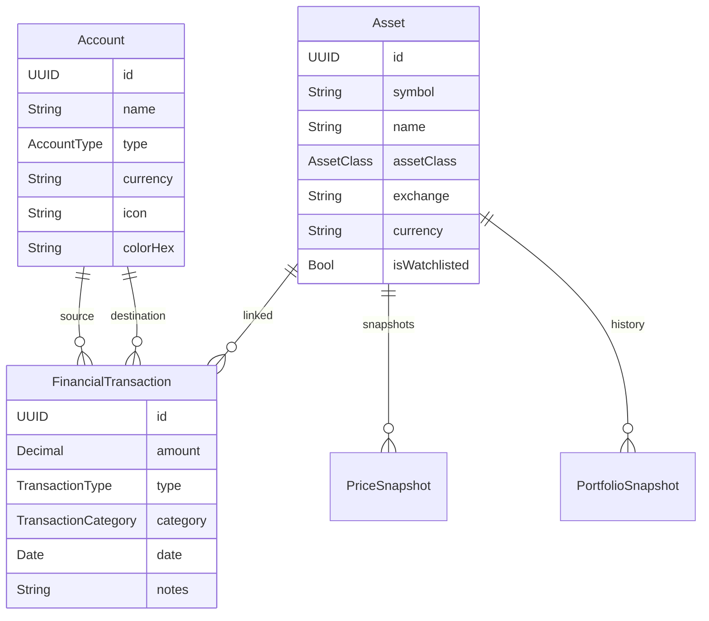

<p align="center">
  
</p>

<h1 align="center">Patrimonial</h1>

<p align="center">
  <strong>Personal finance management for iOS</strong><br/>
  Accounts · Transactions · Investments · Real-time market data
</p>

<p align="center">
  
  
  
  
  
</p>

<p align="center">
  <a href="#about">English</a> · <a href="#sobre">Português</a>
</p>

---

## About

**Patrimonial** is a native iOS app for personal finance and investment management. Built entirely with **SwiftUI** and **SwiftData**, it lets you manage bank accounts, track transactions, follow an investment portfolio with real-time quotes, and visualize cash flow in a centralized dashboard.

---

## Features

### Dashboard
- Net worth overview
- Account cards with real-time balances
- Monthly cash flow chart (income vs. expenses)
- Recent transactions with quick edit
- Balance trend over time

### Accounts
- Create and manage accounts: **Checking**, **Savings**, **Credit Card**, **Brokerage**
- Customizable icon and color per account
- Multi-currency support (EUR default)
- Balance auto-calculated from transactions
- Account detail with full history

### Transactions
- Supported types: **Expense**, **Income**, **Transfer**, **Asset Purchase**, **Asset Sale**, **Dividend**
- Built-in categories: food, transport, rent, health, leisure, subscriptions, etc.
- Custom categories
- Inter-account transfers with bidirectional tracking
- Dedicated forms per operation type

### Investment Portfolio
- Asset search by symbol (stocks, ETFs, crypto)
- Position tracking with average cost and quantity
- Real-time quotes with freshness indicator
- Daily and period variation (1D, 1W, 1M, 3M, 6M, 1Y, YTD)
- Portfolio evolution chart with historical candles
- Allocation by asset class, sector, and currency
- Watchlist for tracking assets without positions
- Manual asset entry for unlisted assets
- Realized and unrealized P&L calculation

### Market Data
- **6 providers** with automatic fallback:

  | Provider | Data |
  |----------|------|
  | **Yahoo Finance** | Quotes, historical candles |
  | **TwelveData** | Quotes, time series, search |
  | **Finnhub** | Quotes, candles |
  | **Alpha Vantage** | Intraday/daily time series |
  | **CoinGecko** | Crypto prices, search, candles |
  | **Frankfurter** | Foreign exchange rates (FX) |

- Market calendar with holidays (NYSE, Euronext, Xetra, LSE)
- Market sessions with adaptive polling windows
- Per-provider rate limiter with daily budget
- GBp → GBP normalization across all boundaries
- Local cache for candles, crypto quotes, and FX rates (SwiftData)

### Design System
- Light and dark theme with manual toggle and `@AppStorage`
- Reusable components: `Card`, `PrimaryButton`, `EmptyState`
- Centralized color palette and typography (`PBTheme`)
- Native iOS layout with `NavigationStack` and `TabView`

---

## Architecture

```
Patrimonial/
├── Models/                     # @Model SwiftData (Account, Asset, FinancialTransaction, ...)
├── Core/
│   ├── MarketData/
│   │   ├── Config/             # AppConfig (reads Secrets.plist)
│   │   ├── Models/             # Quote, FXRate, AssetSearchResult
│   │   ├── Providers/          # Yahoo, TwelveData, Finnhub, AlphaVantage, CoinGecko, Frankfurter
│   │   ├── PriceStore.swift    # In-memory cache + adaptive polling
│   │   ├── CandleStore.swift   # Historical candles with exchange routing
│   │   ├── MarketCalendar.swift# Sessions, holidays, freshness
│   │   └── RateLimiter.swift   # Per-provider rate limiting
│   ├── Portfolio/
│   │   ├── PortfolioCalculator # Holdings, P&L, market value, allocation
│   │   ├── ListingID           # Unique identity (symbol + MIC)
│   │   ├── Holding             # Calculated position with cost basis
│   │   └── PortfolioAllocation # Slices by class/sector/currency
│   ├── Persistence/            # PersistenceController, DataReset
│   ├── Formatters/             # CurrencyFormatter
│   └── Networking/             # Generic NetworkClient
├── Features/
│   ├── Dashboard/              # DashboardScreen, CashFlowDetail, BalanceTrend
│   ├── Accounts/               # AccountsView, AccountDetail, AccountForm
│   ├── Transactions/           # TransactionsView, TransactionForm, TransferForm
│   ├── Portfolio/              # PortfolioScreen, AssetDetail, Watchlist, Search
│   └── Settings/               # SettingsView (theme, data reset)
├── Redesign/                   # PB* — new design system (5 tabs)
│   ├── PBRoot.swift            # Root TabView
│   ├── PBDashboard.swift       # Dashboard screen
│   ├── PBComponents.swift      # Reusable components
│   ├── PBTheme.swift           # Colors, fonts, spacing
│   ├── PBCharts.swift          # Charts
│   └── PBStore.swift           # AppStore (@Observable)
└── DesignSystem/               # Color and font extensions
```

```
PatrimonialTests/               # ~40 test files
├── Fixtures/                   # JSON fixtures (Yahoo, Finnhub, TwelveData, CoinGecko, AlphaVantage)
├── *ProviderTests.swift        # Per-provider tests
├── PortfolioCalculatorTests.swift
├── ListingIdentityTests.swift
├── MarketCalendarTests.swift
└── ...
```

---

## Tech Stack

| Layer | Technology |
|-------|-----------|
| **UI** | SwiftUI |
| **Persistence** | SwiftData (`@Model`, `ModelContainer`) |
| **State** | `@Observable`, `@State`, `@Environment` |
| **Networking** | Native `URLSession` (no external dependencies) |
| **Charts** | Swift Charts |
| **Localization** | `Localizable.xcstrings` (PT/EN) |
| **Testing** | XCTest (~40 test files, JSON fixtures) |
| **External dependencies** | **None** — 100% Apple frameworks |

---

## Requirements

- **iOS 17.0+**
- **Xcode 15.0+**
- **Swift 5.9+**

---

## Getting Started

### 1. Clone the repository

```bash
git clone https://github.com/Dinisls/Patrimonial.git
cd Patrimonial
```

### 2. Configure API keys

The app uses a `Secrets.plist` file (excluded from git) for API keys. Create the file at:

```
Patrimonial/Resources/Secrets.plist
```

With the following structure:

```xml
<?xml version="1.0" encoding="UTF-8"?>
<!DOCTYPE plist PUBLIC "-//Apple//DTD PLIST 1.0//EN"
  "http://www.apple.com/DTDs/PropertyList-1.0.dtd">
<plist version="1.0">
<dict>
    <key>ALPHAVANTAGE_API_KEY</key>
    <string>YOUR_KEY_HERE</string>
    <key>FINNHUB_API_KEY</key>
    <string>YOUR_KEY_HERE</string>
    <key>TWELVEDATA_API_KEY</key>
    <string>YOUR_KEY_HERE</string>
</dict>
</plist>
```

> CoinGecko, Yahoo Finance, and Frankfurter APIs do not require a key.

### 3. Build and run

```bash
open Patrimonial.xcodeproj
```

Select an iOS 17+ simulator or device and run (⌘R).

---

## Testing

```bash
xcodebuild test \
  -scheme Patrimonial \
  -destination 'platform=iOS Simulator,name=iPhone 16' \
  -resultBundlePath TestResults
```

The test suite includes ~40 test files covering:
- Market data providers (with JSON fixtures)
- Portfolio calculator (holdings, P&L, allocation)
- Listing identity (symbol + MIC)
- Market calendar and sessions
- Search and result ranking
- Data reset
- Unpriced positions

---

## Data Model



---

## License

Private project. All rights reserved.

---

<br/>
<br/>

<h1 align="center">🇵🇹 Português</h1>

---

## Sobre

**Patrimonial** é uma aplicação iOS nativa para gestão de finanças pessoais e investimentos. Desenvolvida inteiramente em **SwiftUI** com persistência via **SwiftData**, permite controlar contas bancárias, registar transações, acompanhar um portfolio de investimentos com cotações em tempo real e visualizar o fluxo de caixa num dashboard centralizado.

---

## Funcionalidades

### Dashboard (Resumo)
- Visão geral do património líquido
- Cartões de conta com saldos em tempo real
- Gráfico de fluxo de caixa mensal (receitas vs. despesas)
- Transações recentes com edição rápida
- Tendência de saldo ao longo do tempo

### Contas
- Criação e gestão de contas: **Corrente**, **Poupança**, **Cartão de Crédito**, **Corretora**
- Ícone e cor personalizáveis por conta
- Multi-moeda (EUR por defeito)
- Saldo calculado automaticamente a partir das transações
- Detalhe de conta com histórico completo

### Transações
- Tipos suportados: **Despesa**, **Receita**, **Transferência**, **Compra de ativo**, **Venda de ativo**, **Dividendo**
- Categorias predefinidas: alimentação, transporte, renda, saúde, lazer, subscrições, etc.
- Categorias personalizadas
- Transferências entre contas com rastreio bidirecional
- Formulários dedicados por tipo de operação

### Portfolio de Investimentos
- Pesquisa de ativos por símbolo (ações, ETFs, crypto)
- Registo de posições com preço médio e quantidade
- Cotações em tempo real com indicador de frescura
- Variação diária e por período (1D, 1S, 1M, 3M, 6M, 1A, YTD)
- Gráfico de evolução patrimonial com candles históricas
- Alocação por classe de ativo, setor e moeda
- Watchlist para acompanhar ativos sem posição
- Suporte a adição manual de ativos não listados
- Cálculo de P&L realizado e não realizado

### Market Data
- **6 provedores** de dados de mercado com fallback automático:

  | Provedor | Dados |
  |----------|-------|
  | **Yahoo Finance** | Cotações, candles históricas |
  | **TwelveData** | Cotações, séries temporais, pesquisa |
  | **Finnhub** | Cotações, candles |
  | **Alpha Vantage** | Séries temporais intraday/daily |
  | **CoinGecko** | Preços crypto, pesquisa, candles |
  | **Frankfurter** | Taxas de câmbio (FX) |

- Calendário de mercado com feriados (NYSE, Euronext, Xetra, LSE)
- Sessões de mercado com janelas de polling adaptativas
- Rate limiter por provedor com orçamento diário
- Normalização GBp → GBP em todas as fronteiras
- Cache local de candles, cotações crypto e taxas FX (SwiftData)

### Design System
- Tema claro e escuro com toggle manual e `@AppStorage`
- Componentes reutilizáveis: `Card`, `PrimaryButton`, `EmptyState`
- Paleta de cores e tipografia centralizadas (`PBTheme`)
- Layout nativo iOS com `NavigationStack` e `TabView`

---

## Começar

### 1. Clonar o repositório

```bash
git clone https://github.com/Dinisls/Patrimonial.git
cd Patrimonial
```

### 2. Configurar API keys

A app usa um ficheiro `Secrets.plist` (excluído do git) para as chaves de API. Cria o ficheiro em:

```
Patrimonial/Resources/Secrets.plist
```

Com a seguinte estrutura:

```xml
<?xml version="1.0" encoding="UTF-8"?>
<!DOCTYPE plist PUBLIC "-//Apple//DTD PLIST 1.0//EN"
  "http://www.apple.com/DTDs/PropertyList-1.0.dtd">
<plist version="1.0">
<dict>
    <key>ALPHAVANTAGE_API_KEY</key>
    <string>YOUR_KEY_HERE</string>
    <key>FINNHUB_API_KEY</key>
    <string>YOUR_KEY_HERE</string>
    <key>TWELVEDATA_API_KEY</key>
    <string>YOUR_KEY_HERE</string>
</dict>
</plist>
```

> As APIs da CoinGecko, Yahoo Finance e Frankfurter não requerem chave.

### 3. Abrir e correr

```bash
open Patrimonial.xcodeproj
```

Seleciona um simulador ou dispositivo iOS 17+ e corre o projeto (⌘R).

---

## Testes

```bash
xcodebuild test \
  -scheme Patrimonial \
  -destination 'platform=iOS Simulator,name=iPhone 16' \
  -resultBundlePath TestResults
```

A suite inclui ~40 ficheiros de teste cobrindo:
- Provedores de dados de mercado (com JSON fixtures)
- Calculador de portfolio (holdings, P&L, alocação)
- Identidade de listings (symbol + MIC)
- Calendário de mercado e sessões
- Pesquisa e ranking de resultados
- Reset de dados
- Posições sem cotação (unpriced)

---

<p align="center">
  Made with SwiftUI in Portugal 🇵🇹
</p>
