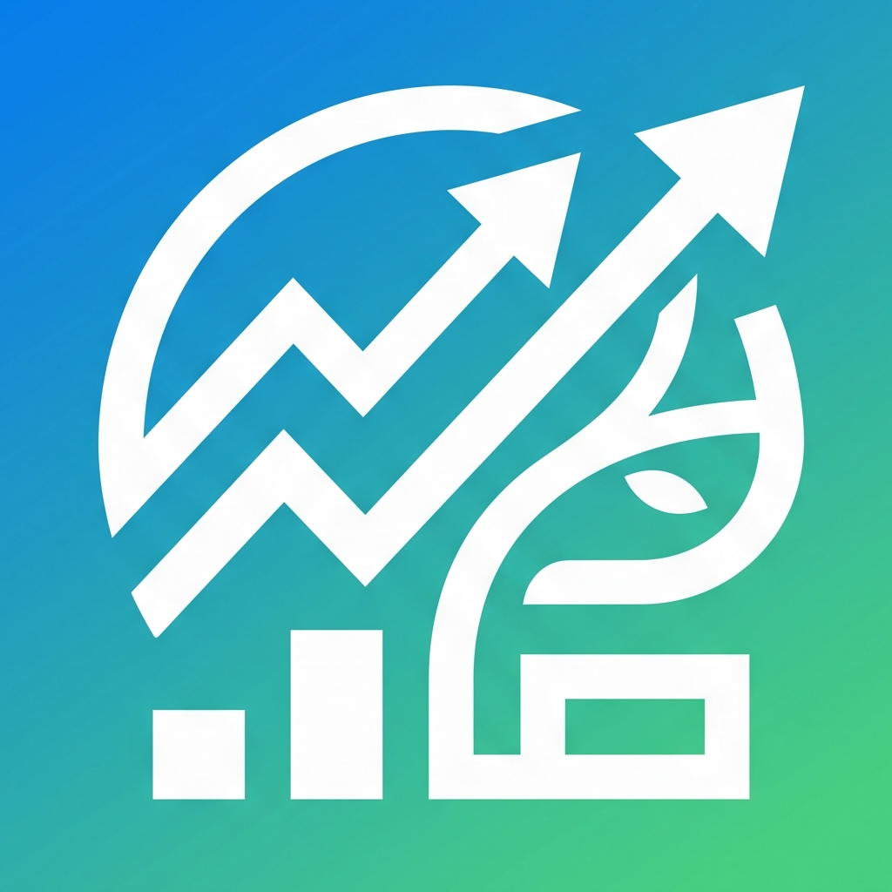
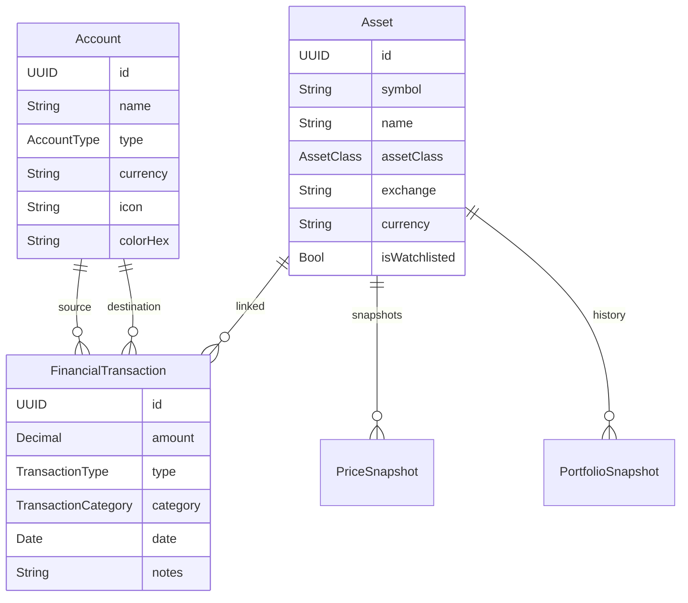

<p align="center">
  
</p>

<h1 align="center">Patrimonial</h1>

<p align="center">
  <strong>Gestão financeira pessoal para iOS</strong><br/>
  Contas · Transações · Investimentos · Câmbio em tempo real
</p>

<p align="center">
  
  
  
  
  
</p>

---

## Sobre

**Patrimonial** é uma aplicação iOS nativa para gestão de finanças pessoais e investimentos. Desenvolvida inteiramente em **SwiftUI** com persistência via **SwiftData**, permite controlar contas bancárias, registar transações, acompanhar um portfolio de investimentos com cotações em tempo real e visualizar o fluxo de caixa num dashboard centralizado.

---

## Funcionalidades

### Dashboard (Resumo)
- Visão geral do património líquido
- Cartões de conta com saldos em tempo real
- Gráfico de fluxo de caixa mensal (receitas vs. despesas)
- Transações recentes com edição rápida
- Tendência de saldo ao longo do tempo

### Contas
- Criação e gestão de contas: **Corrente**, **Poupança**, **Cartão de Crédito**, **Corretora**
- Ícone e cor personalizáveis por conta
- Multi-moeda (EUR por defeito)
- Saldo calculado automaticamente a partir das transações
- Detalhe de conta com histórico completo

### Transações
- Tipos suportados: **Despesa**, **Receita**, **Transferência**, **Compra de ativo**, **Venda de ativo**, **Dividendo**
- Categorias predefinidas: alimentação, transporte, renda, saúde, lazer, subscrições, etc.
- Categorias personalizadas
- Transferências entre contas com rastreio bidirecional
- Formulários dedicados por tipo de operação

### Portfolio de Investimentos
- Pesquisa de ativos por símbolo (ações, ETFs, crypto)
- Registo de posições com preço médio e quantidade
- Cotações em tempo real com indicador de frescura
- Variação diária e por período (1D, 1S, 1M, 3M, 6M, 1A, YTD)
- Gráfico de evolução patrimonial com candles históricas
- Alocação por classe de ativo, setor e moeda
- Watchlist para acompanhar ativos sem posição
- Suporte a adição manual de ativos não listados
- Cálculo de P&L realizado e não realizado

### Market Data
- **6 provedores** de dados de mercado com fallback automático:

  | Provedor | Dados |
  |----------|-------|
  | **Yahoo Finance** | Cotações, candles históricas |
  | **TwelveData** | Cotações, séries temporais, pesquisa |
  | **Finnhub** | Cotações, candles |
  | **Alpha Vantage** | Séries temporais intraday/daily |
  | **CoinGecko** | Preços crypto, pesquisa, candles |
  | **Frankfurter** | Taxas de câmbio (FX) |

- Calendário de mercado com feriados (NYSE, Euronext, Xetra, LSE)
- Sessões de mercado com janelas de polling adaptativas
- Rate limiter por provedor com orçamento diário
- Normalização GBp → GBP em todas as fronteiras
- Cache local de candles, cotações crypto e taxas FX (SwiftData)

### Design System
- Tema claro e escuro com toggle manual e `@AppStorage`
- Componentes reutilizáveis: `Card`, `PrimaryButton`, `EmptyState`
- Paleta de cores e tipografia centralizadas (`PBTheme`)
- Layout nativo iOS com `NavigationStack` e `TabView`

---

## Arquitetura

```
Patrimonial/
├── Models/                     # @Model SwiftData (Account, Asset, FinancialTransaction, ...)
├── Core/
│   ├── MarketData/
│   │   ├── Config/             # AppConfig (lê Secrets.plist)
│   │   ├── Models/             # Quote, FXRate, AssetSearchResult
│   │   ├── Providers/          # Yahoo, TwelveData, Finnhub, AlphaVantage, CoinGecko, Frankfurter
│   │   ├── PriceStore.swift    # Cache em memória + polling adaptativo
│   │   ├── CandleStore.swift   # Candles históricas com routing por exchange
│   │   ├── MarketCalendar.swift# Sessões, feriados, frescura
│   │   └── RateLimiter.swift   # Rate limiting por provedor
│   ├── Portfolio/
│   │   ├── PortfolioCalculator # Holdings, P&L, market value, alocação
│   │   ├── ListingID           # Identidade inequívoca (symbol + MIC)
│   │   ├── Holding             # Posição calculada com custo base
│   │   └── PortfolioAllocation # Slices por classe/setor/moeda
│   ├── Persistence/            # PersistenceController, DataReset
│   ├── Formatters/             # CurrencyFormatter
│   └── Networking/             # NetworkClient genérico
├── Features/
│   ├── Dashboard/              # DashboardScreen, CashFlowDetail, BalanceTrend
│   ├── Accounts/               # AccountsView, AccountDetail, AccountForm
│   ├── Transactions/           # TransactionsView, TransactionForm, TransferForm
│   ├── Portfolio/              # PortfolioScreen, AssetDetail, Watchlist, Search
│   └── Settings/               # SettingsView (tema, reset de dados)
├── Redesign/                   # PB* — novo design system (5 tabs)
│   ├── PBRoot.swift            # TabView raiz
│   ├── PBDashboard.swift       # Ecrã Resumo
│   ├── PBComponents.swift      # Componentes reutilizáveis
│   ├── PBTheme.swift           # Cores, fontes, espaçamento
│   ├── PBCharts.swift          # Gráficos
│   └── PBStore.swift           # AppStore (@Observable)
└── DesignSystem/               # Extensões de cor e fonte
```

```
PatrimonialTests/               # ~40 ficheiros de teste
├── Fixtures/                   # JSON fixtures (Yahoo, Finnhub, TwelveData, CoinGecko, AlphaVantage)
├── *ProviderTests.swift        # Testes por provedor
├── PortfolioCalculatorTests.swift
├── ListingIdentityTests.swift
├── MarketCalendarTests.swift
└── ...
```

---

## Stack Tecnológica

| Camada | Tecnologia |
|--------|-----------|
| **UI** | SwiftUI |
| **Persistência** | SwiftData (`@Model`, `ModelContainer`) |
| **Estado** | `@Observable`, `@State`, `@Environment` |
| **Rede** | `URLSession` nativo (sem dependências externas) |
| **Gráficos** | Swift Charts |
| **Localização** | `Localizable.xcstrings` (PT/EN) |
| **Testes** | XCTest (~40 test files, fixtures JSON) |
| **Dependências externas** | **Nenhuma** — 100% Apple frameworks |

---

## Requisitos

- **iOS 17.0+**
- **Xcode 15.0+**
- **Swift 5.9+**

---

## Instalação

### 1. Clonar o repositório

```bash
git clone https://github.com/Dinisls/Patrimonial.git
cd Patrimonial
```

### 2. Configurar API keys

A app usa um ficheiro `Secrets.plist` (excluído do git) para as chaves de API. Cria o ficheiro em:

```
Patrimonial/Resources/Secrets.plist
```

Com a seguinte estrutura:

```xml
<?xml version="1.0" encoding="UTF-8"?>
<!DOCTYPE plist PUBLIC "-//Apple//DTD PLIST 1.0//EN"
  "http://www.apple.com/DTDs/PropertyList-1.0.dtd">
<plist version="1.0">
<dict>
    <key>ALPHAVANTAGE_API_KEY</key>
    <string>YOUR_KEY_HERE</string>
    <key>FINNHUB_API_KEY</key>
    <string>YOUR_KEY_HERE</string>
    <key>TWELVEDATA_API_KEY</key>
    <string>YOUR_KEY_HERE</string>
</dict>
</plist>
```

> As APIs da CoinGecko, Yahoo Finance e Frankfurter não requerem chave.

### 3. Abrir e correr

```bash
open Patrimonial.xcodeproj
```

Seleciona um simulador ou dispositivo iOS 17+ e corre o projeto (⌘R).

---

## Testes

```bash
xcodebuild test \
  -scheme Patrimonial \
  -destination 'platform=iOS Simulator,name=iPhone 16' \
  -resultBundlePath TestResults
```

A suite inclui ~40 ficheiros de teste cobrindo:
- Provedores de dados de mercado (com JSON fixtures)
- Calculador de portfolio (holdings, P&L, alocação)
- Identidade de listings (symbol + MIC)
- Calendário de mercado e sessões
- Pesquisa e ranking de resultados
- Reset de dados
- Posições sem cotação (unpriced)

---

## Estrutura de Dados



---

## Licença

Projeto privado. Todos os direitos reservados.

---

<p align="center">
  Feito com SwiftUI em Portugal 🇵🇹
</p>
